<html>

<body style="font-family: 'IBM Plex Sans', sans-serif;background-color:#1a1a1a;">

​
</style>
​
<body>

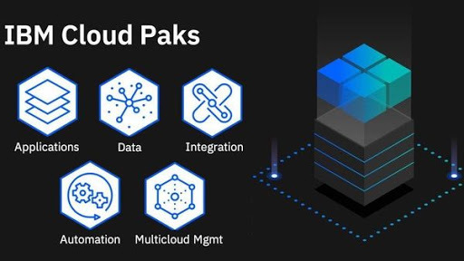

<h2 class="title is-3 ">Cloud Pak Sample App</h2>

 This sample app aims to showcase the functionalities available on the Cloud Pak platform, with regards to Cloud Pak for Data and Cloud Pak for Integration

<h3> Getting Started</h3>

<h2>1. Create an account on IBM's Cloud Platform</h2>

To ensure a completely immersive experience with Cloud Pak services, create an account on IBM's cloud platform.

<a class="button is-dark is-medium" title="Log in here" href="didact://?commandId=vscode.didact.sendNamedTerminalAString&text=nodejs$$ibmcloud login --sso;ibmcloud target --cf;ibmcloud target -g Default ">Log in here</a>
 

 

<h2> 2. Check prerequisites linked to Cloud account</h2>

 This sample app requires the user to avail certain instances present in the Services catalog. The lite version of these services will suffice. The instances are listed below:

<h4>2.1 IBM MQ</h4>

IBM MQ(Message Queue) provides proven, enterprise-grade messaging capabilities, such as point-to-point and publish/subscribe models, to facilitate the flow of information between applications.It enables asynchronous messaging.

<h5>Follow the below steps to create an IBM MQ instance and connect your application data to IBM MQ.</h5>

Step1: Click the below button to create MQ instance through Cloud CLI commands.

<a class="button is-dark is-medium" title="IBM MQ" href="didact://?commandId=vscode.didact.sendNamedTerminalAString&text=nodejs$$ibmcloud resource service-instance-create mqinstance mqcloud lite eu-gb">IBM MQ</a>  

Step 2 : Once the instance is created. Go to <a href="https://cloud.ibm.com/">IBM cloud</a> and click on the resource list as shown in the below figure.Expand the services row and open the new instance that you have created.
 

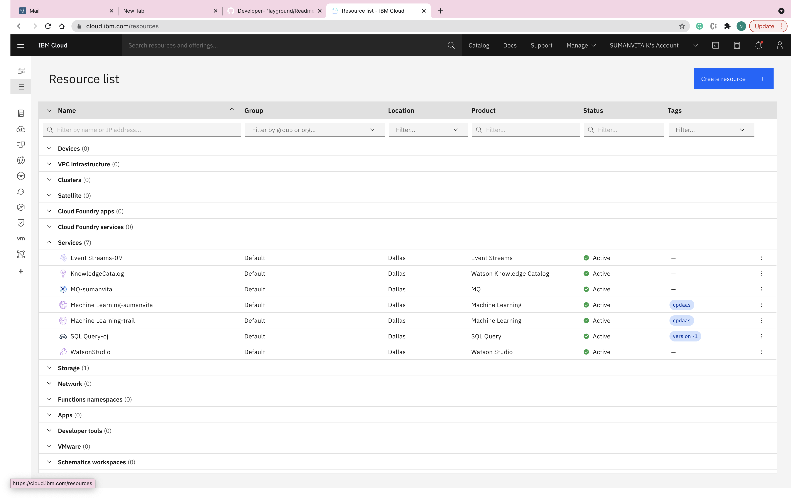

Step 3 : On opening the instance you will be re-directed to a page as shown below.Click on create button to create queue manager.
 

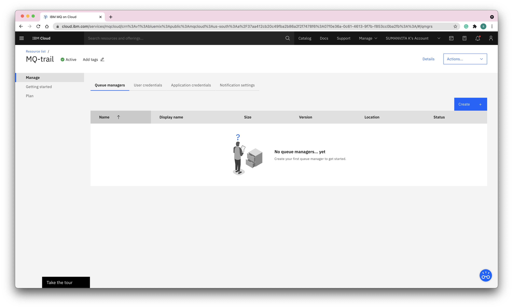

Step 4 : Give queue manager a name and click on create.

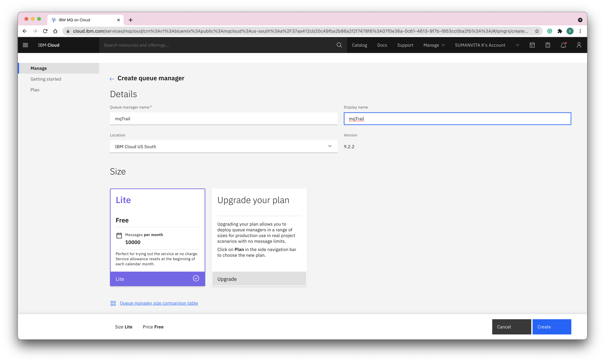

Step 5 : Creating queue manager takes some time. When the status changes to running it indicates that queue manager is ready to use.

Step 6 : Click on Application credentials and click on Add.

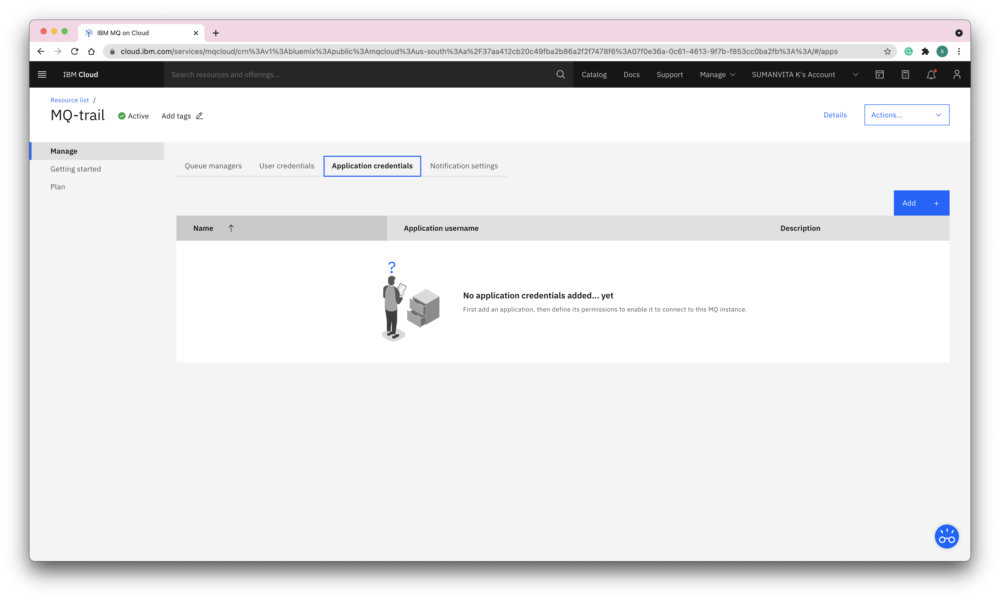

Step 7 : Give a display name and click in add and generate API Key.Download the file

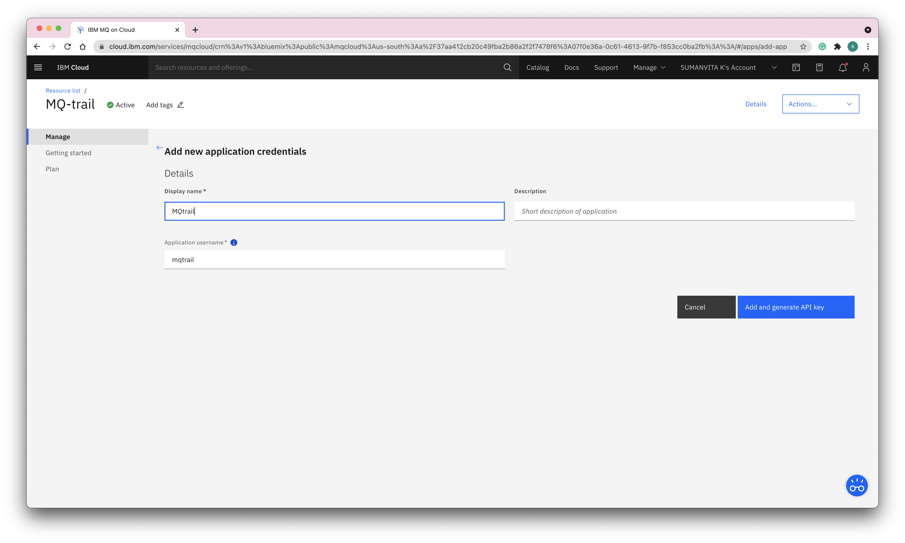

Step 8 : Go to <b>Queue managers</b> tab and click on the queue manager that you have created in step in step3.

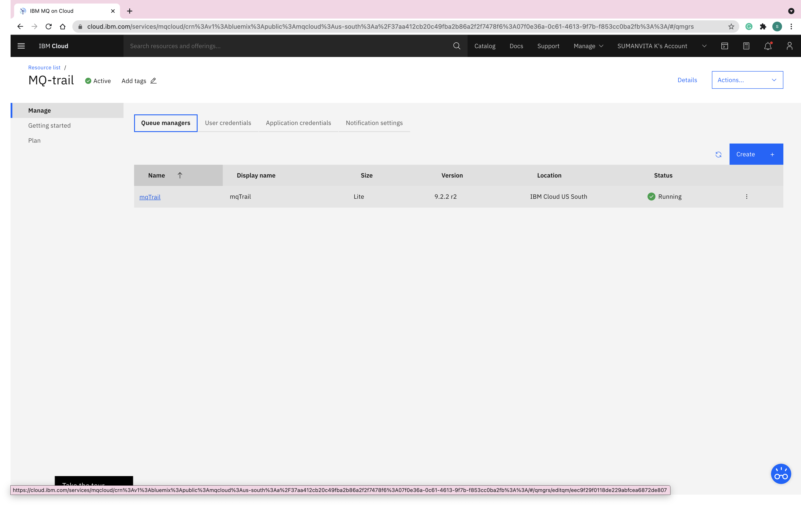

Step 9 : Download the connection information as shown in the below image.

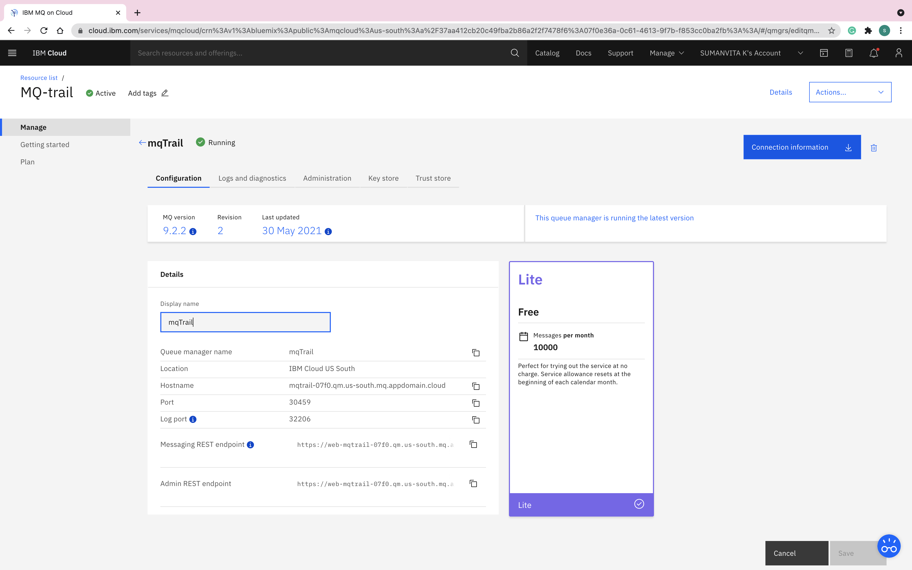
 
 
 
<h4>2.2 Waston Machine Learning </h4>

IBM Watson Machine Learning helps data scientists and developers accelerate AI and machine learning deployment on IBM Cloud Pak for Data.With watson machine learning you can deploy AI models at scale across any cloud on an open.

Click on the below button to create a machine learning instance on IBM cloud .

<a class="button is-dark is-medium" title="Machine Learning" href="https://dataplatform.cloud.ibm.com/data/catalog/pm-20?context=cpdaas&target=services">Machine Learning</a>
 

On clicking the above button you will be redirected to a page as shown in the below figure.

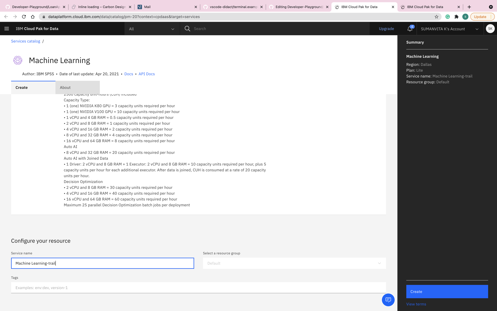
 
 ̌
<h4>2.3 MongoDB on IBM cloud</h4>

Click on the below button to create a MongoDB instance on IBM cloud .

<a class="button is-dark is-medium" title="Databases for MongoDB" href="https://dataplatform.cloud.ibm.com/data/catalog/databases-for-mongodb?context=cpdaas&target=services">Databases for MongoDB</a> 

On clicking the above button you will be redirected to a page as shown in the below figure.

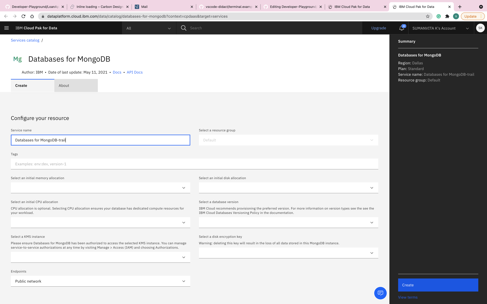
 
</body>

<h2>3. Clone the GitHub repo for this Sample App</h2>

This Sample app needs to be cloned onto the Developer playground. It only takes a few minutes to do so.

<a class="button is-dark is-medium" title="Get the code" href="didact://?commandId=vscode.didact.sendNamedTerminalAString&text=nodejs$$git+clone+https://github.ibm.com/SUMANVITA-K/LoanApp-MQ">Get the code</a> 

<h2>4.Deploy ML Model</h2>

To deploy the ML model to deployment space the program will ask for API key and space id

<ul><h6>Steps to generate API Key</h6>
<li>

Step 1 : Haven't logged in to IBM Cloud ? then click  <a  href="didact://?commandId=vscode.didact.sendNamedTerminalAString&text=nodejs$$ibmcloud login --sso">login to ibm cloud</a>
 

</li>
<li>

Step 2 :  Click <a href="didact://?commandId=vscode.didact.sendNamedTerminalAString&text=nodejs$$ibmcloud iam api-key-create ApiKey-LoanApp-MQ -d 'this is my API key' --file key_file">Generate api key</a> through IBM cloud CLI commands.
This will generate API key with name <b>MyKey</b> and the value of API key will be stored in <b>key_file</b> file in the main directory of the project.
</li>
</ul>

<ul><h6>Steps to generate deployment space</h6>
<li>

Step 1 : Go to <a href="https://dataplatform.cloud.ibm.com/">IBM CloudPak for data</a> and login with your mail id. Once you login click on view all spaces button as shown in the figure below.
 

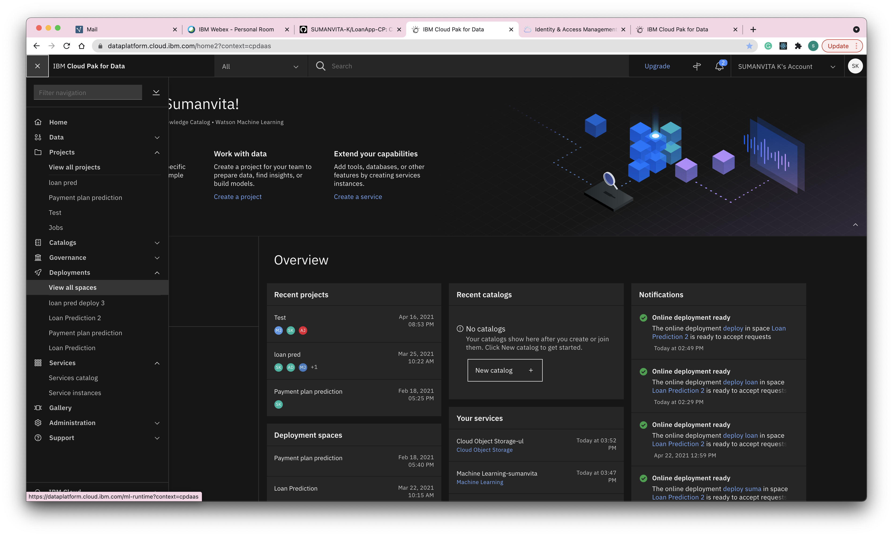
</li>
<li>

Step 2 :  Click on create deployment space.

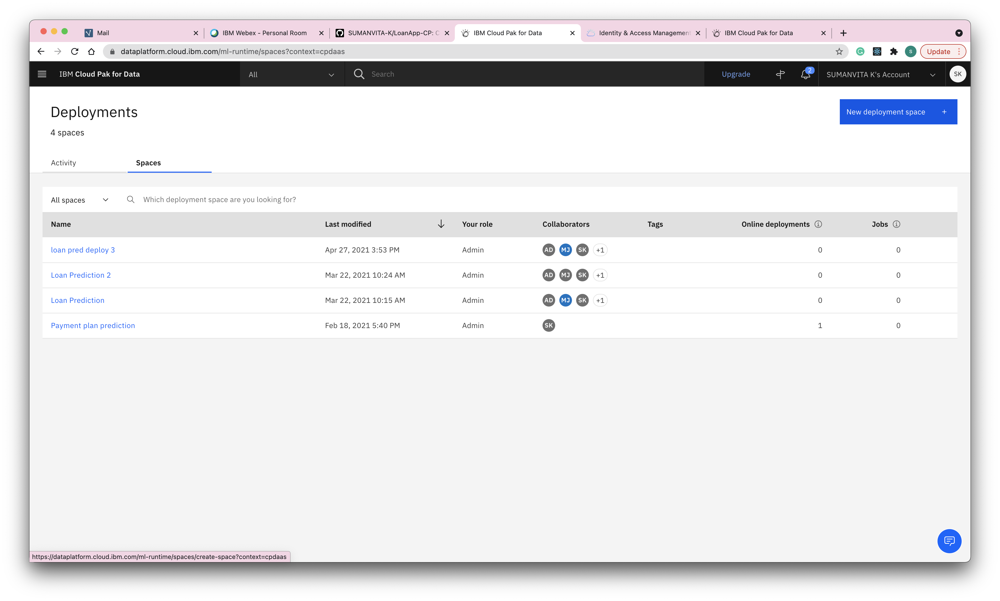
</li>
<li>
Step 3 : Give the deployment a name and add a machine learning instance that you have earlier created.Click on create button after filling the details.

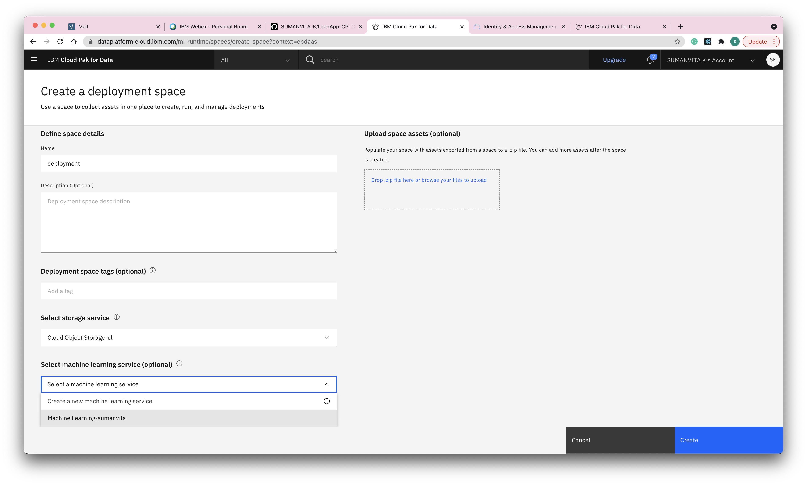
</li>
<li>

Step 4 : Click on view deployement space and then select manage tab.Under this tab, copy the space GUID.

</li>
</ul>

<a class="button is-dark is-medium" title="Build the App" href="didact://?commandId=python.createTerminal">open python terminal</a> 

<a class="button is-dark is-medium" title="Build the App" href="didact://?commandId=vscode.didact.sendNamedTerminalAString&text=Python$$pip3+install+-r+requirements.txt;python3+./DeployModel/DeployMLModel.py">Deploy Model</a> 

<h2>5. Build the App</h2>

 Build the application to explore it's functionalities within the given terminal.

<a class="button is-dark is-medium" title="Build the App" href="didact://?commandId=vscode.didact.sendNamedTerminalAString&text=nodejs$$cd+LoanApp-CP;npm+install">Build the App</a> 

<h4>6.Adding credentials to the App</h4>

CLick the below button to open the .env file. 

<a class="button is-dark is-medium" title="Edit environment variables" href="didact://?commandId=vscode.open&projectFilePath=.env">Edit environment variables</a> 
 
<b>Follow the below instructions to plugin the correct values in the env file.</b>
 

Open the connection information file that you have downloaded from section 2.1 step8.Replace the values of <b>host_name</b>, <b>queue_manager_name</b> in .env file with <b>hostname</b>, <b>queueManagerName</b> 
 of connection_info.json file respectively.Now open the Application API key file that you have downloaded from section2.1 step 6.Replace <b>user_name</b>, <b>api_key_mq</b> of .env file with the <b>mqUsername</b>, <b>apiKey</b> of applicationApiKey.json file respectively.

 

<h2>7.Launch the Application</h2>

Upon launching the app,the application will start running. 

<a class="button is-dark is-medium" title="Launch the Application" href="didact://?commandId=vscode.didact.sendNamedTerminalAString&text=nodejs$$npm+start">Launch the Application</a> 

<!-- <h2>7. Explore the Code.</h2>

<a class="button is-dark is-medium" title="Explore the Code" href="didact://?commandId=workbench.view.explorer">Explore the Code</a>  

 -->

<h2>8.Delete Deployment</h2>

Deleting deployment will help you save CUH.

<a class="button is-dark is-medium" title="Delete deployment" href="didact://?commandId=vscode.didact.sendNamedTerminalAString&text=Python$$python3+./DeleteDeploy/deleteDeploy.py">Delete deployment</a> 

<h2>9.Delete API key</h2>

Click the below button to delete API key generated in step 4 through IBM cloud CLI command both from the sample app and IBM cloud.

<a class="button is-dark is-medium" title="Delete API Key" href="didact://?commandId=vscode.didact.sendNamedTerminalAString&text=nodejs$$cd LoanAPP-MQ ;ibmcloud iam api-key-delete ApiKey-LoanApp-MQ ; rm key_file">Delete API Key</a> 